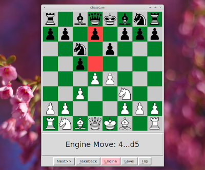

CamChess is a free open source program that enables you to play against a computer with a standard tournament board and pieces. It uses a camera to identify moves on the board. It is optimised for a standard tournament vinyl roll up board with green squares and black and "light wood" coloured plastic pieces. I am currently using a Raspberry Pi Zero W with an attached ZeroCam to capture board images. I have fixed them to a door frame with sticky tape. The Pi Zero talks to my desktop computer over WiFi. The repository contains PiCam.py which runs on the Pi Zero, and CamChess.py which runs on a my desktop computer. Both programs are writen in Python, and CamChess.py uses OpenCV and python-chess.

## Website

The CamChess website can be found [here](https://camchess.blogspot.com).

## Creator

Geoff Fergusson

## Licenses

CamChess (and PiCam) are available under the MIT license. See the LICENCE file for details. CamChess uses Merida chess piece images. These images are available under a GNU licence, which is in the Pieces folder.
