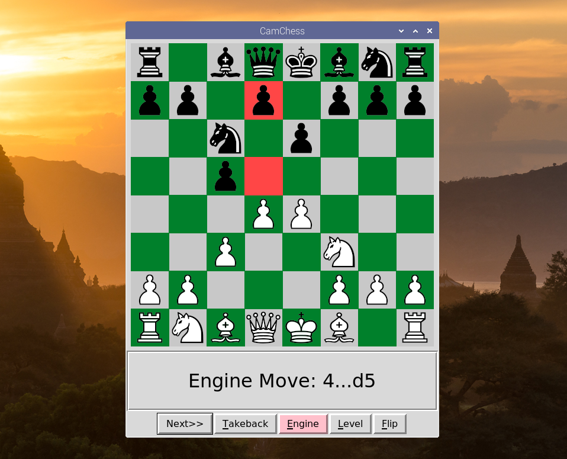

CamChess is a free open source program that enables you to play against a computer with a standard tournament board and pieces. It uses a camera to identify moves on the board. It is optimised for a vinyl roll up board with dark green squares and black and "light wood" coloured plastic pieces. I am using a Raspberry Pi Zero with an attached ZeroCam to capture board images. The Pi Zero talks to a Raspberry Pi 4B over TCP/IP. (You can also use a Linux, Windows or Mac PC.) I have set up the Pi Zero as an Ethernet gadget. It both sends data and receives power over a single USB cable. The repository contains PiCam.py which runs on the Pi Zero, and CamChess.py which runs on the other computer. (It also contains CamSet.py, which runs on the other computer and is useful for setting up the camera.) The programs are written in Python, and CamChess.py uses OpenCV and python-chess.

## Website

The CamChess website can be found [here](https://camchess.blogspot.com).

## Creator

Geoff Fergusson

## Licenses

CamChess, PiCam and CamSet) are available under the MIT license. See the LICENCE file for details. CamChess uses Merida chess piece images. These images are available under a GNU licence, which is in the Pieces folder.
